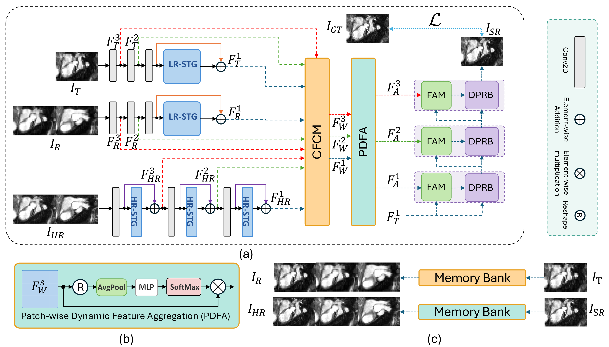

<div align="center">

# STRMSR: Cardiac MRI Through-Plane Super-Resolution Guided by Reference and Memory

Shaoming Pan¹, Chenchuhui Hu¹, Leon Axel², Meng Ye¹

¹ Department of Computer Science and Engineering, University of Texas at Arlington
² NYU Grossman School of Medicine

[](https://www.python.org/)
[](https://pytorch.org/)

_STACOM @ MICCAI 2026_

</div>

---

## Overview

Cardiac MRI is acquired with high in-plane resolution but thick slices, so the
through-plane direction is blurred. **STRMSR** recovers that missing detail from an
undersampled low-resolution (LR) view by combining two sources of guidance:

- **Reference views** — high-resolution slices from another orientation of the same
  heart, which contain the anatomy that the low-resolution view lost.
- **Memory** — previously reconstructed frames, so information is carried along the
  cardiac cycle instead of each frame being restored on its own.

Each frame is reconstructed in four stages:

1. **Encoding** — three encoders (target LR, reference LR, reference HR) build feature pyramids.
2. **Matching** — CFCM warps the reference features onto the target.
3. **Selection** — PDFA picks the best reference per patch.
4. **Reconstruction** — FAM + DPRB fuse and reconstruct coarse-to-fine.

Training uses an L1 image loss plus a k-space consistency term.

## Highlights

- Guidance from a **different acquisition orientation** of the same heart, not the LR view alone.
- **CFCM** aligns reference anatomy before fusion, so misregistration does not blur the output.
- **PDFA** selects among multiple reference views independently for each patch.
- **Temporal memory** propagates information along the cardiac cycle.
- **k-space consistency** keeps the reconstruction faithful to the measurements.

## Method



**(a)** Overall architecture: three encoders (target LR, reference LR, reference HR)
feed CFCM for matching/warping and PDFA for patch-wise view selection, then FAM + DPRB
reconstruct the SR output coarse-to-fine. **(b)** The PDFA block. **(c)** Memory banks:
past LR frames supply the reference stream and past reconstructions supply the HR stream.

| Module | Name | Role |
|---|---|---|
| CFCM | Coarse-to-Fine Contextual Matching | Matches and warps reference features onto the target |
| PDFA | Patch-wise Dynamic Feature Aggregation | Softmax-weights the views per patch |
| FAM | Feature Alignment Module | Aligns warped reference to target at each scale |
| DPRB | Dense Progressive Reconstruction Block | Fuses and reconstructs coarse-to-fine |

## Results

STRMSR is evaluated at **4x** and **8x** undersampling with per-case MSE / SSIM / PSNR
(see the paper for the full comparison and ablations). `test.py` reports the same
metrics for any trained checkpoint; `--metric_mode` selects whether they are computed on
the real channel, the magnitude, or both.

## Installation

```bash
git clone https://github.com/<your-org>/STRMSR.git
cd STRMSR

conda activate <your_env>   # Python 3.9, PyTorch >= 1.10
pip install nibabel scikit-image opencv-python tqdm pillow scipy
```

A CUDA GPU is required.

## Data

Datasets are not distributed with the repo. Training and test roots use the same
structure — one folder per case, NIFTI (`*.nii.gz`) volumes inside:

```
data_root/
├── GT/       <case>/*.nii.gz          ground-truth high-resolution
├── InputLR/  <case>/*.nii.gz          undersampled input, upsampled to HR size
├── RefLR/    <case>/<view>/*.nii.gz   low-resolution reference views
└── RefHR/    <case>/<view>/*.nii.gz   high-resolution reference views
```

Volumes are read as magnitude, normalized to [0,1] and treated as pseudo-complex
(real channel + zero imaginary channel).

## Training

Edit `DATA_ROOT` at the top of a launcher script and run it:

```bash
bash options/train_4x.sh   # 4x undersampled input
bash options/train_8x.sh   # 8x undersampled input
```

Or call the entry point directly — every hyper-parameter defaults to the cardiac 4x
setup, so only `--data_root` is required:

```bash
python train.py \
  --data_root /path/to/dataset_train \
  --experiment_name STRMSR_cardiac_4x \
  --acceleration_factor 4 \
  --upscale 4 \
  --height 176 \
  --width 256 \
  --batch_size 2 \
  --n_epochs 250 \
  --lr 1e-4 \
  --temporal_memory 2 \
  --temporal_frames 4 \
  --max_frame_gap 3 \
  --sequences_per_case 8 \
  --enable_temporal \
  --gpu_ids 0 1
```

Paper hyper-parameters: Adam (`β₁ = 0.5`, `β₂ = 0.999`), lr `1e-4` with step decay
(`--step_size 50`, `--gamma 0.5`), 250 epochs, batch size 2, input `176 × 256`, network
SR factor 4, window size 8, temporal memory of 2 frames. The 8x recipe is the same but
with `--acceleration_factor 8` and shorter sequences (3 frames, 6 sequences per case),
which is more memory-hungry.

> **Note.** `--upscale` is the network's SR factor (always 4) and is *not* the
> undersampling rate — that is `--acceleration_factor` (4 or 8).

Outputs land in `<output_path>/outputs/<experiment_name>/`:

```
checkpoints/model_epoch<N>.pt
train_loss.csv
metrics.csv
options.json
```

Resume with `--resume outputs/<experiment_name>/checkpoints/model_epoch<N>.pt`.


## Inference

```bash
python test.py \
  --data_root /path/to/dataset_test \
  --resume outputs/STRMSR_cardiac_4x/checkpoints/model_final.pt \
  --experiment_name STRMSR_cardiac_4x_test \
  --acceleration_factor 4 \
  --temporal_memory 2 \
  --height 176 \
  --width 256 \
  --metric_mode magnitude \
  --gpu_ids 0
```

`--acceleration_factor`, `--temporal_memory`, `--height` and `--width` must match the
values used for training. Predictions are written as PNGs to
`<output_path>/outputs/<experiment_name>/Pred/<case>/`, and per-case MSE / SSIM / PSNR
are reported at the end of the run. Add `--amp` for fp16 inference.

More usage examples: [options/stacom_cardiac.md](options/stacom_cardiac.md).

## Repository structure

```
STRMSR/
├── train.py                      # training entry point
├── test.py                       # batched inference + metrics
├── utils.py                      # output-folder helpers
├── datasets/
│   ├── STRMSR_Dataset.py         # NIFTI loader, temporal sequence sampling
│   └── utilizes.py               # dataset helpers
├── models/
│   ├── model_STRMSR.py           # training wrapper (losses, optimizer, eval)
│   └── losses.py                 # image + k-space losses, metrics
├── networks/
│   ├── network_STRMSR.py         # the network (CFCM, PDFA, FAM, DPRB)
│   ├── pro_D.py                  # discriminator
│   └── spectral.py               # spectral normalization
├── options/                      # ready-to-run training scripts + usage docs
│   ├── train_4x.sh
│   ├── train_8x.sh
│   └── stacom_cardiac.md
└── assets/                       # architecture figure
```

## Key options

| Option | Meaning |
|---|---|
| `--upscale` | Network SR factor (4). Not the undersampling rate. |
| `--acceleration_factor` | Undersampling factor of the input (4 or 8) |
| `--temporal_frames` | Frames per training sequence |
| `--temporal_memory` | Previous frames kept as memory |
| `--max_frame_gap` | Max spacing between sampled frames |
| `--enable_temporal` | Enable temporal sequence sampling |
| `--no_kspace` | Disable the k-space consistency loss |
| `--metric_mode` | `real`, `magnitude` or `both` for PSNR/SSIM |

## Citation

If you use this code, please cite:

```bibtex
@article{pan2026cardiac,
  title   = {Cardiac MRI Through-Plane Super-Resolution Guided by
             Reference and Memory},
  author  = {Pan, Shaoming and Hu, Chenchuhui and Axel, Leon and Ye, Meng},
  journal = {arXiv preprint arXiv:2607.07581},
  year    = {2026}
}
```
<!-- Update venue/pages/publisher once the proceedings are finalized. -->

## Acknowledgements

The Swin Transformer feature encoders and the reference-based super-resolution
formulation build on prior work cited in the paper.
